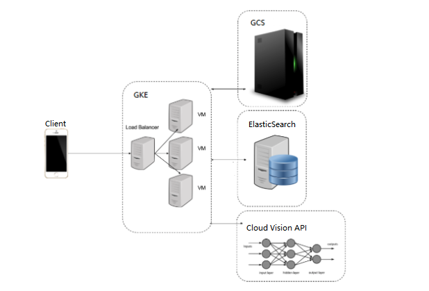

# Go-Around

[Project DEMO](https://recordit.co/5yJRqMo8pb)

## Brief Summary

This go-around project is a geo-index based social network application which provides interesting services.In the application, our registered users can share their image posts and video posts. and checking the posts nearby. This is a  full stack application. The fronted is  using ReactJS and the backend is implemented by Go. Also, this application contains Google Vision API to do the face detection automatically, so users can also check nearby faces through this application.

## Frontend

* Built a geo-based social network web application with React JS.
* Implemented basic token based registration/login/logout flow with React Router v4 and server-side user authentication with JWT.

## Backend
* Used Ant Design, GeoLocation API and Google Map API to Implement features such as Create New Posts, Image/Video Posts Gallery, Nearby Posts in Map.
* Used Google Vision API to provide a face detection model and integrate with Go service.
* Utilized ElasticSearch (GCE) to provide geo-location-based search functions such that users can search nearby posts within a distance (e.g. 200km).
* Launched a scalable web service in Go to handle posts and deployed to Google Cloud (GKE) for better scaling.

## Project Structure

Frontend Ract components

Backend structure

## References

* [Example of generate token based on jwt-go library](https://godoc.org/github.com/dgrijalva/jwt-go#example-New--Hmac)
